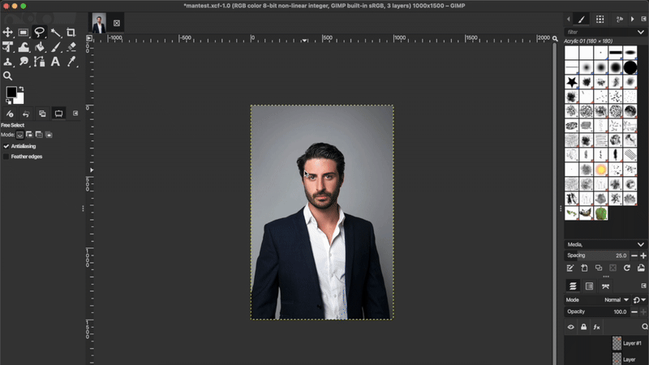

# GIMP AI Integration
---
This AI Integration plug-in brings inpainting capabilities to GIMP 3.0, allowing users to leverage powerful AI tools like [Stable Diffusion XL](https://huggingface.co/diffusers/stable-diffusion-xl-1.0-inpainting-0.1) to upgrade their image-editing workflow.


## Table of Contents
---
* [Installation](#installation)
    * [MacOS](#macos)
    * [A note on Linux installation](#a-note-on-linux-installation)
* [Usage](#usage)
    * [Things to remember](#things-to-remember)
* [Development Specifications](#development-specifications)
* [License](#license)

## Installation
---

[Back to top](#table-of-contents)  

> This plug-in is only available for GIMP 3.0 and later (this includes the RC releases). In the future I may look for a method of making this compatible with GIMP 2.

### MacOS
```bash
$ curl -sSL https://raw.githubusercontent.com/KedarPanchal/GIMP-AI-Inpainting/main/install.sh -o install.sh
$ bash ./install.sh
```
Do not run the `install.sh` script with elevated privileges (i.e. as `sudo`), as this may break where the script attempts to install the plug-in.

### A note on Linux installation
Linux's distribution of GIMP 3.0—at the time of writing—comes in either AppImage or Flatpak form. Both of these formats run in a read-only sandbox environment, meaning the required dependencies for the plug-in cannot be installed. However, I do intend on seeking alternative solutions in which Python interpreters external to GIMP can be used to circumvent this issue.

## Usage
---
[Back to top](#table-of-contents)  

<a  href="resources/GIMP-AI-Inpainting-Demo.mp4">
    
</a>
<p style="text-align: center; font-size: 11">Click on the image to navigate to a video version of this demo!</p>

To use the plug-in, first make a selection on the layer you wish to modify using AI and ensure that layer is selected. The selection should encompass the area you wish to modify. Then, open the plug-in by navigating to the `Filters > Render` menu within GIMP and clicking on the `AI-Integration` menu item. There, you'll be greated by a UI with the following parameters:

* **Prompt:** A description of characteristics or items you want the AI model to add to the image.
* **Negative prompt:** A description of characteristics or items you *don't* want the AI model to add to the image.
* **Steps:** The number of passes the AI model makes to generate the end result. Higher values may lead to better image quality at the cost of time.
* **CFG:** How strictly the AI model should adhere to your prompt and negative prompt. Higher values increase prompt adherance, but lower values allow for greater variety.
* **Strength:** How much the AI model's generation should impact the original image. This value ranges from `0.0` to `1.0`.
* **Seed:** A value that guides the AI generation process that controls what pseudo-random numbers the AI generates. Given all of the other parameters are the same, generating two images with the same seed yields the same output. Conversely, generating two images with different seeds yields different outputs. Seeds are generated automatically by the plug-in, but can be altered by users in the plug-in UI should they wish to.
* **CPU Offloading:** When turned on, the CPU is utilized in conjunction with the GPU to perform the processes necessary for generating an image. This reduced the amount of VRAM used in the image generation process, but increases the generation time. On Apple Silicon devices with unified memory, this parameter has no impact.

After inputting values for each parameter, click the `OK` button to run the AI, or click the `CANCEL` button to exit the plug-in.

### Things to remember
* When using this plug-in for the first time, the generation may take longer than usual as the AI model is being downloaded from the internet.
* If you encounter stutters or slow-downs during the generation process, be sure to close out any unused applications and/or ensure the `CPU Offloading` parameter is enabled in the plug-in UI.
    * This plug-in runs the AI model on your local machine, meaning that it is resource-intensive during the generation process. Stable Diffusion XL—the model used in this plug-in—is a hefty one, requiring at least 8GB of VRAM in conjunction with 12 GB of RAM, or 16GB of unified memory, to run smoothly.

## Development Specifications
---
[Back to top](#table-of-contents)  

* **Device**: M4 Macbook with 16GB Unified Memory
* **OS:** MacOS Sequoia 15.3.2
* **Platforms:** GIMP 3 RC2, GIMP 3 RC3, GIMP 3.0

## License
---
[Back to top](#table-of-contents)  

The GNU GPLv3 License 2025 - [Kedar Panchal](https://github.com/KedarPanchal). Please look at the [LICENSE](LICENSE) for more information.